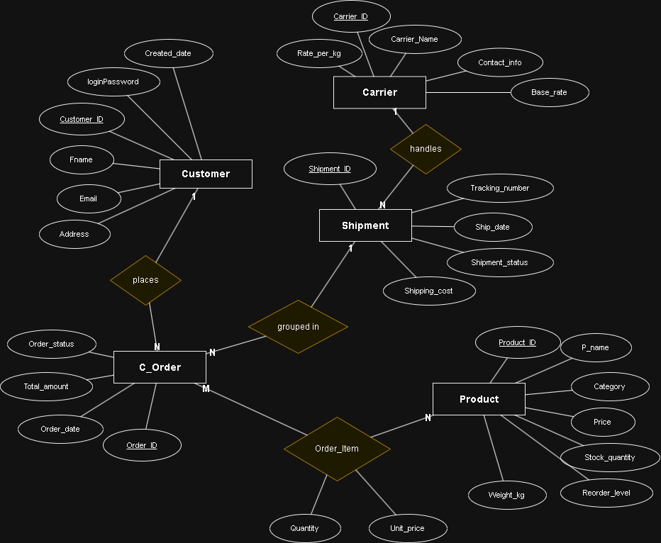

# Inventory and Order Management System

This is a web app for a small online store. It keeps track of the products and the stock, it takes the customers orders, it works out the shipping cost from the customers country and how heavy their items are, and then it puts the orders into shipments with a carrier.

Its made with Flask and MySQL. There is no ORM used anywhere in the project. Every query is written out by hand and run as a parameterised statement, which also means the app is not open to SQL injection.

This is my project for DV1703 (Databasteknik) at BTH.

---

## Contents

- [What does it actually do?](#what-does-it-actually-do)
- [What its made with](#what-its-made-with)
- [Installation](#installation)
- [Logical model](#logical-model)
- [SQL queries](#sql-queries)
- [Project structure](#project-structure)
- [What was hard](#what-was-hard)

---

## What does it actually do?

The whole idea is very simple if you break it down. A store has products, people buy them and someone needs to keep track of what is left in stock so you dont sell products you dont have. And when someone purchase something, you have to ship it to them, which means figuring out which shipping company to use and how to charge. Doing all that manually would lead to a disaster, so the system does it automatically.

**So who is this for?**

There are two types of users:

**Customers:** they just want to see the products, add products to their cart and buy it. They also want to check where their order is after they have bought it, like "is it still being packed? Or is it on the way? Or did it get delivered?".

**Store managers/admin:** these are the people that runs things in the background. They need to see when the products are running low in stock so they can order more, they update the shipment status and they want to see some numbers like how much money came in and what is selling well.

**What the customer side does**

- It shows the products with their prices and stock levels. If something is low in stock, it is marked red.
- Customers can add products to a basket. I used a localStorage so the basket stay even if you close and open the browser.
- It calculates the shipping cost from the customers country and how heavy their items are.
- When someone do a purchase, the system checks if everything is actually in stock and then subtracts those quantities so nobody else can buy the same item.
- The customers can log in and see their order history, both ongoing and past orders.

**What the admin side does**

- A restock list that shows the products that needs restocking, and a form to add more stock.
- The orders are grouped into shipments and are placed in the right carrier automatically. The admin can update the status with a button. The status would show status like "Preparing", "In-Transit" and "Delivered".
- I also added a count down when you mark orders as delivered. The count down give you a few second to undo it if you clicked on "Delivered" by mistake.
- There are also some charts like total revenue, new customers this month, sales by category and a pie chart for the most viewed categories.

**The shipping rates**

Each carrier have their own rates for their region. Its a base rate plus a rate per kg:

| Region | Carrier | Base rate | Per kg |
|---|---|---|---|
| Scandinavia | Unville Croft | 75 kr | 18 kr |
| Americas | Hellsborn | 20 kr | 12 kr |
| Africa | Frieght Dorman | 39 kr | 5 kr |

I just made those number up but they are about the same range as real freight pricing.

**Where does the data comes from?**

I made up some sample products like wireless headphones, smart watches, bluetooth speaker, USB hub, shirts, jeans, hoodie and a some books. Each product has a price, weight and stock quantity. On top of that there are the carriers with a different base rate and rate per kg for each region. As people sign up and place orders, all of that data is saved too. So its like a mix of made up data and real data when somebody starts using it.

---

## What its made with

| Part | What i used |
|---|---|
| Backend | Python 3.8 or higher, Flask |
| Database | MySQL 8.0 or higher (it also works on MariaDB) |
| Database driver | mysql-connector-python (no ORM) |
| Config | python-dotenv |
| Frontend | Jinja2 templates, plain JavaScript and CSS |

---

## Installation

### 1. Get the code and the packages

You need Python 3.8 or higher and MySQL 8.0 or higher.

```bash
git clone https://github.com/Pyo-Wol/LogisticMS.git
cd LogisticMS/python-mysql-workshop
python3 -m venv venv
source venv/bin/activate        # on Windows: venv\Scripts\activate
pip install -r requirements.txt
```

### 2. Make the database

```bash
cd logisticMS/database
mysql -u root -p < Create_Database_Tables.sql
mysql -u root -p < calc_shipping_cost.sql
```

The first file makes the database Logistic_MS, the six tables and the sample products and carriers. The second one makes the stored functions and the triggers.

### 3. Make a database user

Dont run the app as root. On Linux the root account normally logs in with the unix_socket plugin, so it will not accept a password from the app and you get ERROR 1698.

```sql
CREATE USER 'logistic_app'@'localhost' IDENTIFIED BY 'your_password';
CREATE USER 'logistic_app'@'127.0.0.1' IDENTIFIED BY 'your_password';
GRANT ALL PRIVILEGES ON Logistic_MS.* TO 'logistic_app'@'localhost';
GRANT ALL PRIVILEGES ON Logistic_MS.* TO 'logistic_app'@'127.0.0.1';
FLUSH PRIVILEGES;
```

### 4. Make the .env file

Make a file called `.env` inside `python-mysql-workshop`:

```
DB_HOST=127.0.0.1
DB_PORT=3306
DB_USER=logistic_app
DB_PASSWORD=your_password
DB_NAME=Logistic_MS
SECRET_KEY=any_long_random_string
```

> On Linux the DB_NAME is case sensitive. The schema makes `Logistic_MS`, so if you write `logistic_ms` you will get "Unknown database". This file is in the gitignore and should never be committed.

### 5. Start the app

```bash
cd logisticMS/python
python main.py
```

It will be shown at http://localhost:5000.

To see the admin dashboard you use the admin login that is in main.py: `admin@gmail.com` and `admin123`. The customer accounts are made from the sign up page. The sign up only takes countries that a carrier is delivering to, which is Sweden, Norway, Denmark, USA, Mexico, Canada, Nigeria, South Africa and Egypt.

---

## Logical model

I created about six table and this is what is in each one:

**customer:** name, email, address (the address is mostly used for the shipping part, like calculating the shipping cost), when their account was created and their password. The Email is declared as UNIQUE because it is what you use to log in with. That makes it a candidate key, that way the database make sure that no two accounts share the same email, instead of letting only the application to check it.

**product:** every product has a ID, name, category (like Electronics, Clothing or Books), price, stock quantity, reorder level (its 5 by default) and weight in kg. The reorder level is a per product limit. So when the stock drops to the limit or below it, the product is shown in the admin dashboard so the manager knows what to order more in.

**carrier:** these are the shipping companies which i made up. They have an id, name, contact info, base rate and a rate per kg. Both rates are saved as DECIMAL(10,2) so they handle decimal values properly, so those two are the same type.

**c_order (customer orders):** when a customer buys a product, it creates an order. The primary key in this table is just the Order_ID. Thats the only identifier. The Customer_ID and Shipment_ID are the foreign keys. They point at the other tables, but they are not identifiers for the order itself. And the Total_amount is calculated from the items so it cant be part of a primary key either, since it changes every time something is added to the order. The order also has a status and a date.

**order_item:** this table connects the orders to products. One order can have multiple item and each item remembers which product, the quantity and the price it was at the time. So if the item price was changed later, the old order still shows what the customer actually paid. The primary key here are the Order_ID and Product_ID. These two IDs are unique so they stop the same product from being added twice in the same order.

**shipment:** this is where all of the delivery info are. Each shipment has an ID, which carrier is handling it, a tracking number, a ship date, status and the shipping cost which is calculated using a stored function. The status for the shipment can be "Preparing", "In-Transit" or "Delivered". One shipment can group multiple orders going to the same region.

### How do they connect?

A customer can have multiple orders. One customer, many orders. An order can have many of the order items. One order, many items. Each order item is linked to one product and to one order, and a product can show up in many different orders. Each order belongs to one shipment and one shipment groups many orders from the same region. Each shipment is handled by one carrier and one carrier handles multiple shipments.

### Relationships

**Customer places c_order:** a one to many. Because one customer can have many orders. The Customer_ID is a foreign key in the c_order, so each order points back to the customer who made the order.

**C_order contains order_item:** another one to many. The Order_ID is a foreign key in the order_item and each order item belongs to one order.

**Order_item refers to product:** many to one. Since many order item can reference the same product. The Product_ID is a foreign key in the order_item. The order_item is the M:N relationship between c_order and product.

**Shipment groups c_order:** one shipment can group many orders from the same carrier region, so it is one to many from shipment to c_order. I implement it with a single foreign key, which is: c_order holds a Shipment_ID pointing at the shipment table. In just one direction. The shipment doesnt store the Order_ID, because you can always query it the other way and storing it on both sides could lead to it creating a circular reference.

**Carrier handles shipment:** another one to many, because one carrier handle many shipments. The Carrier_ID is a foreign key in the shipment table.

### The diagram



This diagram uses the Chen notation which means: the rectangles are the entities, the diamonds are the relationships, ovals are the attributes, underlined words are the primary keys. The numbers or symbols on the lines shows how many items can be linked (M:N). The order_item part is drawn as a diamond because it connects the orders and products, and it have a many to many relationship. The order_item has attributes like Quantity and Unit_price. When you turn the diagram into database tables, the order_item becomes a table with a combined key made of Order_ID and Product_ID.

### Keys

| Table | Primary key | Foreign key | Other constraints |
|---|---|---|---|
| customer | Customer_ID (AUTO_INCREMENT) | None | Email UNIQUE (candidate key which is used to log in) |
| product | Product_ID (AUTO_INCREMENT) | None | P_name UNIQUE, CHECK on price, stock and weight |
| carrier | Carrier_ID (AUTO_INCREMENT) | None | CHECK on both rates |
| shipment | Shipment_ID (AUTO_INCREMENT) | Carrier_ID | Tracking_number UNIQUE |
| c_order | Order_ID (AUTO_INCREMENT) | Customer_ID, Shipment_ID | The Total_amount is calculated and kept correct by triggers |
| order_item | Order_ID, Product_ID | Order_ID, Product_ID | CHECK Quantity > 0, Unit_price >= 0 |

---

## SQL queries

### 1. Getting the customers order history

When a customer login and goes to their profile, they will want to see what they have bought before and what is still on the way. This query pulls everything like the orders, the item, product names and the prices and then stick them all together.

```sql
SELECT o.Order_ID, o.Order_date, o.Order_status,
       p.P_name, oi.Quantity, oi.Unit_price
FROM c_order o
JOIN order_item oi ON o.Order_ID = oi.Order_ID
JOIN product p     ON oi.Product_ID = p.Product_ID
WHERE o.Customer_ID = %s
ORDER BY o.Order_date DESC;
```

This joins the c_order, order_item and product. The WHERE clause gets the orders for one customer. After that i loop through the results in python and group them by order ID, that way i can show each order with its list of items.

### 2. Finding low stock products

For the admin dashboard i needed a way to show which product need restocking. The query below compares each products stock against its own Reorder_level column, so different product can have different restock points without me touching the code.

```sql
SELECT Product_ID, P_name, Price, Stock_quantity
FROM product
WHERE Stock_quantity <= Reorder_level;
```

Its only one table and not much going on here. But it is needed for the admin to know what needs restocking and is the reason the Reorder_level column exists.

### 3. Total revenue from delivered orders

The admin dashboard also shows the amount of money that has come in. This is the gross revenue and not profit. I used COALESCE so i get 0 instead of NULL when there are no orders.

```sql
SELECT COALESCE(SUM(oi.Quantity * oi.Unit_price), 0) AS total
FROM order_item oi
JOIN c_order o ON oi.Order_ID = o.Order_ID
WHERE o.Order_status IN ('Delivered');
```

This query uses a JOIN between order_item and c_order for only counting items from orders that have been delivered, and then the SUM does the aggregation by adding all of those line as total.

### 4. Sales by category for the current month

The bar chart in the admin panel need to show how many items have been sold in each category this month. So i gathered all of the orders from the first of the month onwards and then group them together by category and count the quantity total sold.

```sql
SELECT p.Category, SUM(oi.Quantity) AS total
FROM order_item oi
JOIN c_order o ON oi.Order_ID = o.Order_ID
JOIN product p ON oi.Product_ID = p.Product_ID
WHERE o.Order_date >= %s
GROUP BY p.Category;
```

The %s is replaced with something like this "2026-08-01".

### 5. Using a stored function to calculate the shipping cost

I created a MySQL function that calculates the total shipping cost for an order depending on the customers country and the total weight of the items. It calls two helper functions that finds the carriers rates.

```sql
CREATE FUNCTION calc_shipping_cost(p_country VARCHAR(100), p_order_id INT)
RETURNS DECIMAL(10,2)
NOT DETERMINISTIC
READS SQL DATA
BEGIN
    DECLARE v_base_rate DECIMAL(10,2);
    DECLARE v_rate_per_kg DECIMAL(10,2);
    DECLARE v_total_weight DECIMAL(10,3);
    SET v_base_rate = get_base_rate(p_country);
    SET v_rate_per_kg = get_rate_per_kg(p_country);
    SELECT COALESCE(SUM(p.Weight_kg * oi.Quantity), 0) INTO v_total_weight
    FROM order_item oi
    JOIN product p ON oi.Product_ID = p.Product_ID
    WHERE oi.Order_ID = p_order_id;

    RETURN v_base_rate + (v_rate_per_kg * v_total_weight);
END$$
```

The reason why this function is marked as NOT DETERMINISTIC is because it reads data from the tables that can change. If i mark it as DETERMINISTIC, then MySQL will reuse the old results and give wrong answers. It also needs READS SQL DATA, if you leave that out the function will not even be created when binary logging is turned on. The COALESCE is used so that the orders without any items return a zero instead of NULL. The helper functions get_base_rate and get_rate_per_kg finds the correct carrier for the country and read the shipping rates from the carrier table.

### 6. Triggers to keep the order total correct

The Total_amount on c_order is not a value that is typed in manually, but it is calculated and it comes from adding up every line in order_item. Instead of calculating the Total_amount everytime, the system stores the value in the table anyway. This is called denormalisation (trying to improve the read performance of a database, at the expense of losing some write performance, by adding redundant copies of data). In short its a way to calculate the value to make things faster.

```sql
CREATE TRIGGER update_order_total_after_insert
AFTER INSERT ON order_item
FOR EACH ROW
BEGIN
    UPDATE c_order
    SET Total_amount = (SELECT COALESCE(SUM(Quantity * Unit_price), 0)
                        FROM order_item WHERE Order_ID = NEW.Order_ID)
    WHERE Order_ID = NEW.Order_ID;
END$$
```

The AFTER UPDATE and AFTER DELETE trigger are the same. The delete one reads the OLD.Order_ID instead of the NEW.Order_ID.

### 7. All shipment details for the admin panel

This one took me almost 4 days to get it to work and its the most complicated query in the project. When the admin looks at the carrier section, they need to see every shipment, the orders that are in it and who the customers are in each shipment. This means joining about 5 tables, which are shipment, c_order, customer, order_item and product.

```sql
SELECT s.Shipment_ID, s.Carrier_ID, s.Shipment_status, s.Ship_date,
       s.Tracking_number, s.Shipping_cost,
       o.Order_ID, c.Fname, p.P_name, oi.Quantity, oi.Unit_price
FROM shipment s
JOIN c_order o     ON o.Shipment_ID = s.Shipment_ID
JOIN customer c    ON o.Customer_ID = c.Customer_ID
JOIN order_item oi ON oi.Order_ID = o.Order_ID
JOIN product p     ON p.Product_ID = oi.Product_ID
ORDER BY s.Carrier_ID, s.Shipment_ID, o.Order_ID;
```

This query returns one row for each product in each order. That means i have to do some grouping in python to rebuild the structure. But still it gives me exactly everything i need in one database call. I think its the best example of multiple JOINs in my project.

---

## Project structure

```
python-mysql-workshop/
├── requirements.txt
├── .env                        (not in git)
└── logisticMS/
    ├── database/
    │   ├── Create_Database_Tables.sql   the tables and sample data
    │   ├── calc_shipping_cost.sql       the functions and triggers
    │   └── er_diagram.drawio.png
    └── python/
        ├── main.py             the flask routes
        ├── functions.py        the queries and the data grouping
        ├── database.py         the connection
        ├── templates/          the html files
        └── static/             the css and the images
```

The main.py only holds the routes. All of the queries and the work of putting the data together is in functions.py.

---

## What was hard

**The circular references.** This was the first thing that i fixed. The foreign keys pointing in both direction means i needed to create the order, create the shipment and then go back to updating the order again, and none of the table can be inserted without the other. So by keeping the link in one direction on the order, it removes the whole circular reference.

**The AUTO_INCREMENT.** The random ID generator i had before worked as it should, but it was easy for something to go wrong. For example if two people signed up at the exact same time, there would be a chance of them getting the same ID generated. By using the AUTO_INCREMENT, it handles all of that and i dont need to think about it.

**The 5 table query.** It gave me a lot of duplicate rows, because each product in an order comes back as its own row and i had to do extra work in python to group them up properly. But still, i think its the right decision because it does one database call instead of one per shipment.

**Two people buying the last item.** I thought about what happens when several people tries to buy the last item at the same time. In the purchase route i check the stock level before inserting anything and the whole thing runs in a transaction. So if something fails everything rolls back and i dont end up with orders that cant be fulfilled. The CHECK constraint on the Stock_quantity is the backstop: even if the check in the code loses a race, the database will refuse to let the stock go negative.

**The table names.** All of the tables are made in lowercase. MySQL table names are case sensitive on Linux, so if the schema has mixed case names and the queries use lowercase names, it breaks as soon as the project leaves Windows.

---

## Made by

Bate Macjohn Bate Manjoh, DV1703 Databasteknik, BTH.
